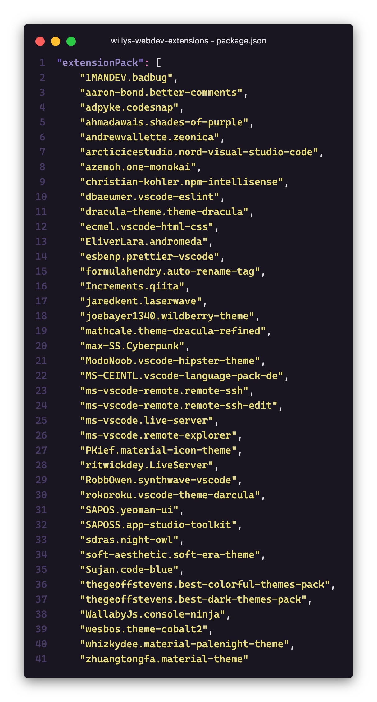

# 👨🏻‍💻 Web Dev Essentials + 🎨 Awesome Themes

This is my personal VS Code extension pack. It includes a collection of extensions that I find useful for my development workflow.

<p align="center">
<br>

</p>

## Extensions Included

In this extension pack, the following extensions are included:


### [Better Comments](https://marketplace.visualstudio.com/items?itemName=aaron-bond.better-comments)<br>

Brief description about what this extension does.

- [Extension Name 3](https://marketplace.visualstudio.com/items?itemName=author.extension3)<br>
  Brief description about what this extension does.

## Themes included

- [BADBUG Theme](https://marketplace.visualstudio.com/items?itemName=1mandev.badbug&utm_source=VSCode.pro&utm_campaign=AhmadAwais)<br>
  > A collection of beautifully crafted modern themes for VSCode.

## Installation

To install this extension pack, follow these steps:

1. Open Visual Studio Code
2. Press `Ctrl+P` to open the Quick Open dialog
3. Type <br>
   ```
   ext install willys-webdev-extensions
   ```

## Contributing

If you want to suggest an extension to this pack, please open an issue in the GitHub repository, don't pull request.
